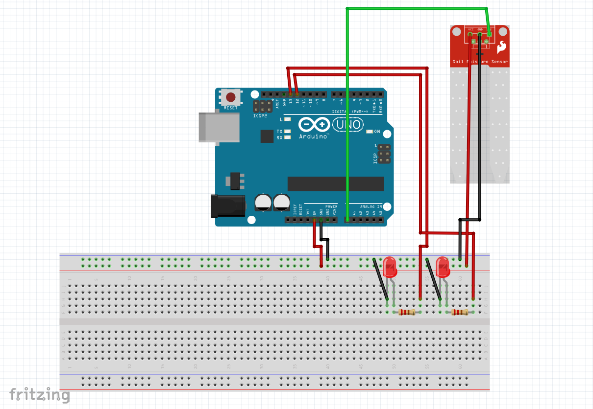

# Arduino-pySerial-tutorial
Tutorial for basic programming of Arduino and communication between Arduino and Python using pySerial.

Download the Arduino IDE:
https://www.arduino.cc/en/software

 

###Components you will need:
1. Arduino uno microcontroller.
2. MH water sensor.
3. Breadboard (optional).
4. Blue led.
5. Green led.
6. 220R resistor [X2].
7. jumper wires [X9]

 

###Connect the arduino according to the scheme:

  

## Other resources:
A great beginners guide to Arduino and Python using the pyFirmata library:
https://realpython.com/arduino-python/
\
Intro to Arduino:
\
https://learn.sparkfun.com/tutorials/what-is-an-arduino/all

 

####Project combining Arduino and Python:
https://create.arduino.cc/projecthub/projects/tags/python

 

####Documentation:
Pyserial - https://pyserial.readthedocs.io/\
serial python - https://pyfirmata.readthedocs.io/en/latest/
\
MicroPython - https://micropython.org/\
CircuitPython - https://circuitpython.org/